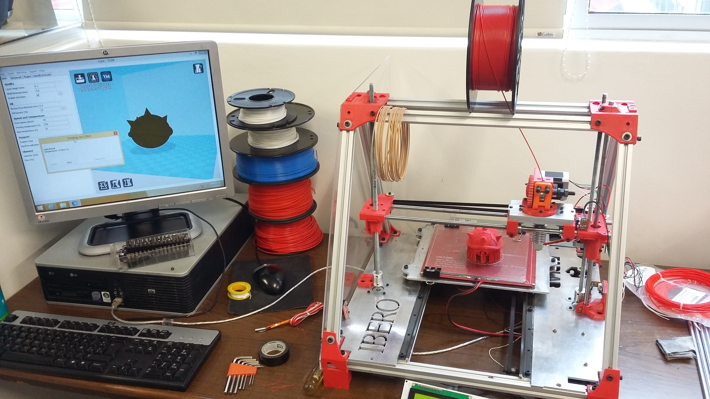

# Historia y popularización de la impresión 3D

La historia de la impresión 3D es una transición tecnológica de más de cuarenta años en la que se cruzan patentes, laboratorios de investigación, empresas de prototipado rápido, comunidades de hardware abierto, repositorios de modelos, software libre, caída de costos, cultura maker y una nueva forma de aprender fabricación.

En este capítulo la impresión 3D se analiza como una tecnología que cambió de escala social. Primero fue una herramienta costosa para departamentos de ingeniería, laboratorios de investigación, diseño automotriz, aeroespacial y desarrollo de producto. Después se convirtió en una máquina de escritorio para diseñadores, escuelas, FabLabs y usuarios independientes. Hoy conviven ambos mundos: sistemas industriales de cientos de miles de dólares para polímeros, resinas y metales; impresoras profesionales de escritorio para ingeniería, odontología y diseño; e impresoras FDM accesibles que permiten a estudiantes y comunidades fabricar sus primeros prototipos.

Antes de la manufactura aditiva, **fabricar un prototipo físico podía tomar días, semanas o meses**. En ingeniería mecánica, diseño industrial y desarrollo de producto, una pieza requería normalmente maquinado, fundición, fabricación manual, moldes o herramentales. Esto hacía que el **error de diseño fuera caro**: una interferencia entre dos piezas, una mala ergonomía, un volumen incorrecto o un detalle geométrico mal resuelto podía descubrirse tarde.

La idea que impulsó a las primeras tecnologías de impresión 3D fue: **usar datos digitales para construir directamente un objeto físico**, capa por capa, sin fabricar primero un molde o retirar material de un bloque completo.En sus primeras décadas, el término más usado no era "impresión 3D", sino **rapid prototyping** o prototipado rápido. El objetivo principal era acelerar el ciclo de desarrollo.La pieza no era de acabado final, era un modelo visual, una maqueta de ensamble, una pieza para verificar ergonomía, normalmente era un objeto para convencer a un cliente antes de fabricar el producto real.

## 1980–1986: Estereolitografía, Chuck Hull y la primera patente.

La tecnología que normalmente se reconoce como la primera impresión 3D comercial fue la **estereolitografía** o **SLA**. Chuck Hull, cofundador de 3D Systems, desarrolló la idea a inicios de los años ochenta. En 1983 produjo una de las primeras piezas impresas mediante fotopolimerización, en **1984** presentó la solicitud de patente y en 1986 se concedió la patente estadounidense **[US4575330A](https://patents.google.com/patent/US4575330A/en)**, titulada *Apparatus for Production of Three-Dimensional Objects by Stereolithography*.

La patente describe un sistema para fabricar objetos tridimensionales creando patrones de sección transversal sobre un medio líquido capaz de cambiar de estado físico, por ejemplo una resina curable con luz ultravioleta. Las capas sucesivas se integran entre sí hasta formar el objeto completo. Convertir secciones digitales en capas físicas sigue siendo la base conceptual de la impresión 3D actual.

**3D Systems fue fundada en 1986** y comercializó la tecnología SLA en el ambiente industrial. La **SLA-1**, enviada comercialmente a finales de los años ochenta, se convirtió en uno de los símbolos del inicio de la impresión 3D como industria.

**Tipo de usuario de la época:** centros de diseño industrial; departamentos de ingeniería de empresas grandes; automotriz; aeroespacial; laboratorios de investigación; empresas de prototipado; oficinas de diseño de producto.

**Uso principal:** modelos conceptuales; validación de forma; prototipos para revisión visual; patrones para fundición; reducción de tiempos de diseño.

**Costo aproximado:** Las primeras impresoras 3D industriales se encontraban en rangos de cientos de miles de dólares. Algunas fuentes históricas ubican equipos de los años ochenta en el orden de **300,000 a 400,000 USD**, sin considerar materiales, mantenimiento, software, instalación ni capacitación. La impresión 3D nació como tecnología de alto costo.

## 1987–1992: Tecnología SLS(Selective Laser Sintering) y FDM(Fused Deposition Modeling)

El **Sinterizado Selectivo por Láser** o **SLS** fue desarrollado por Carl Deckard y Joe Beaman en la Universidad de Texas en Austin durante los años ochenta. Una patente estadounidense de **1989** representativa de esta familia tecnológica es **[US4863538A](https://patents.google.com/patent/US4863538A/en)**, *Method and apparatus for producing parts by selective sintering*. A diferencia de SLA, que utiliza resina líquida, SLS trabaja con polvo. Un láser sinteriza o fusiona selectivamente regiones de una cama de polvo, capa por capa.

La tecnología fue comercializada por **DTM Corporation**, empresa que después sería adquirida por 3D Systems en 2001. SLS se volvió muy importante porque permitió fabricar piezas funcionales, especialmente en polímeros como nylon, sin requerir soportes tradicionales: el polvo no sinterizado sostiene la pieza durante la fabricación.

**Tipo de usuario:** empresas de ingeniería avanzada; automotriz; aeroespacial; laboratorios de materiales; servicios de manufactura; fabricantes que necesitaban piezas funcionales de geometría compleja.

**Ventajas históricas de SLS:** piezas más funcionales que muchas piezas SLA tempranas; posibilidad de geometrías complejas; fabricación de lotes pequeños; menor dependencia de soportes; uso de polímeros técnicos.

**Limitaciones históricas:** máquinas costosas; control térmico complejo; manejo de polvo; postprocesado especializado; difícil adopción doméstica.

SLS nunca se volvió una tecnología doméstica, pero sí fue una de las tecnologías que empujó a la manufactura aditiva hacia aplicaciones funcionales e industriales.

La tecnología que más tarde dominaría la impresión 3D de escritorio fue **FDM** (*Fused Deposition Modeling*), patentada por Scott Crump y comercializada por **Stratasys**. La patente **[US5121329A](https://patents.google.com/patent/US5121329A/en)**, concedida en **1992**, describe un método y aparato para crear objetos tridimensionales mediante deposición controlada de material.

FDM utiliza filamento termoplástico, lo calienta y lo deposita capa por capa. En el mundo abierto y maker también se usa el término **FFF** (*Fused Filament Fabrication*), especialmente para evitar el uso de una marca registrada asociada a Stratasys.

**Primer mercado de FDM:** ingeniería; prototipado funcional; diseño de producto; automotriz; herramentales ligeros; validación de piezas en ABS.

En 1992 Stratasys vendió su primera impresora FDM, la **3D Modeler**. A diferencia de SLA, FDM ofrecía una ruta con termoplásticos más familiares para ingeniería. La pieza no tenía el acabado de una pieza de resina, pero acercaba la impresión 3D a prototipos más robustos.

## 1993–2000: prototipado rápido, Z Corporation e impresión más rápida

Durante los años noventa, la manufactura aditiva se mantuvo principalmente como una tecnología industrial. Los equipos eran costosos y estaban orientados a empresas que podían justificar el precio con ahorro de tiempo en diseño y desarrollo.

Una empresa importante fue **Z Corporation**, fundada en 1994 a partir de tecnología desarrollada en el MIT. Sus impresoras usaban una estrategia de **binder jetting**: depositar un aglutinante líquido sobre capas de polvo. Modelos como la **Z402** se hicieron conocidos por producir prototipos de manera rápida. En 1999, *Wired* describía la Z402 como una impresora capaz de producir modelos desde archivos CAD en minutos y como una alternativa mucho más rápida que otras tecnologías de prototipado de la época.

La base técnica de este proceso se relaciona con el trabajo de **Emanuel Sachs, Michael Cima, John Haggerty y Paul Williams** en el MIT. Una patente clave es **[US5204055A](https://patents.google.com/patent/US5204055A/en)**, *Three-dimensional printing techniques*, concedida en **1993**. Esta patente describe la fabricación de componentes mediante la deposición de una primera capa de material poroso o polvo y la aplicación selectiva de un material aglutinante. Después, el proceso se repite capa por capa hasta formar el objeto, retirando finalmente el polvo no unido.

**Tipo de usuario de Z Corp:** diseño de producto;
arquitectura; calzado; automotriz; laboratorios de visualización; empresas que necesitaban modelos físicos rápidos y visuales.

**Uso principal:** modelos de presentación; geometrías conceptuales; maquetas; prototipos de comunicación; modelos a color en generaciones posteriores.

La importancia de Z Corp fue cultural y tecnológica: acercó la impresión 3D a la idea de "imprimir modelos" de manera más parecida a una impresora convencional, aunque seguía siendo una solución profesional.

## 2002: Stratasys Dimension y la reducción del costo profesional

Un salto relevante ocurrió en 2002 con la familia **Dimension** de Stratasys. La compañía presentó la **Dimension 3D Printer** a un precio de introducción de **29,900 USD**. Aunque hoy sigue pareciendo alto, en su momento fue importante porque bajó la barrera para diseñadores profesionales. Stratasys la presentó como una máquina confiable, compacta y relativamente simple de usar, aproximadamente a la mitad del costo de la siguiente impresora 3D de menor precio en ese momento.

El valor de Dimension fue acercar FDM a oficinas de ingeniería y diseño que no podían adquirir una plataforma industrial de cientos de miles de dólares.

**Usuarios típicos:** oficinas de diseño mecánico; departamentos de ingeniería; universidades; laboratorios de producto; empresas medianas con necesidad de prototipado interno.

**Para qué se usaba:** modelos de validación; pruebas de ensamble; prototipos en ABS; herramientas simples; revisión de interferencias; comunicación con clientes.

Modelos posteriores como **Dimension 1200es** ofrecían volúmenes de construcción de aproximadamente **254 × 254 × 305 mm**, con cartuchos de material ABS y soporte soluble. Esta etapa profesionalizó la impresión 3D como equipo de oficina técnica, aunque todavía no la convirtió en herramienta de bajo costo para FabLabs.

## 2004–2008: RepRap y el cambio de paradigma

El cambio más importante para la democratización de la impresión 3D no vino de una gran empresa industrial, sino de una idea universitaria y abierta: **RepRap**.

El proyecto **RepRap** fue iniciado por **Adrian Bowyer** en la Universidad de Bath, Inglaterra, Reino Unido. Con el propósito de crear una impresora 3D de bajo costo, abierta y capaz de fabricar una parte significativa de sus propios componentes: una propuesta de fabricación distribuida.

La idea central era radical para la época: *Si una impresora puede fabricar muchas de sus propias piezas, entonces otras personas pueden construir nuevas impresoras, modificarlas, mejorarlas y compartirlas.*

En **2008**, el modelo **RepRap Darwin** alcanzó un hito simbólico: una máquina RepRap imprimió las piezas plásticas necesarias para construir otra máquina funcional. El Science Museum Group describe a Darwin como la primera impresora 3D autorreplicante RepRap y señala que los diseños y software eran open source, libres para descargarse y usarse.

RepRap cambió tres cosas al mismo tiempo:
1. **El costo**: muchas piezas podían imprimirse o conseguirse en ferreterías, tiendas de electrónica o proveedores comunes.
2. **El conocimiento**: los planos, firmware y documentación se compartían.
3. **La cultura**: los usuarios dejaron de ser solamente compradores y se volvieron constructores, modificadores y documentadores.

Esto fue fundamental para los FabLabs. Una impresora 3D dejó de ser una caja cerrada y se convirtió en un sistema que podía entenderse: motores, varillas, correas, hotend, firmware, electrónica, G-code, calibración, extrusión y materiales.

Mientras una impresora profesional podía costar  miles de dólares, algunos proyectos y kits inspirados en RepRap comenzaron a prometer impresoras de cientos de dólares. En reportes de la época se hablaba de RepRap como una máquina construible por debajo de **400 USD**, aunque el costo real dependía fuertemente de disponibilidad de piezas, electrónica, herramientas, calidad de componentes y experiencia del usuario.

**¿Por qué RepRap pudo avanzar aunque existían patentes FDM?**
Stratasys no compró originalmente la tecnologiía FDM: la tecnología fue desarrollada por **Scott Crump**, cofundador de la empresa. La patente clave, **[US5121329A](https://patents.google.com/patent/US5121329A/en)**, titulada *Apparatus and method for creating three-dimensional objects*, fue solicitada en 1989 y concedida en 1992. Durante los años noventa y buena parte de los dos mil, esto mantuvo la extrusión de termoplástico dentro de un mercado industrial dominado por Stratasys.

RepRap comenzó en **2005**, cuando la patente base de FDM estaba cerca de expirar. Además, RepRap no nació como una empresa que vendía impresoras comerciales a departamentos de ingeniería, sino como un **proyecto académico, experimental y abierto**. Su objetivo era explorar una impresora de bajo costo, parcialmente autorreplicable y documentada públicamente. Esto redujo el riesgo de conflicto directo porque el proyecto no competía inicialmente con el negocio industrial de Stratasys.

También fue importante el uso del término **FFF** (*Fused Filament Fabrication*) en lugar de **FDM**. FDM estaba asociado a Stratasys como denominación comercial; FFF se volvió el término genérico usado por la comunidad abierta para describir impresoras que extruyen filamento fundido sin utilizar la marca comercial de Stratasys. Por eso, en muchos documentos de código abierto, educación y cultura maker se habla de FFF cuando técnicamente el principio de fabricación se parece al FDM industrial.

Las máquinas RepRap tampoco eran copias directas de equipos Stratasys. Las impresoras industriales usaban cámaras, materiales propietarios, sistemas de soporte, control térmico, software y servicios profesionales. Las RepRap usaban varillas, motores paso a paso, electrónica de bajo costo, firmware abierto, hotends simples, piezas imprimibles y materiales genéricos. Eran más limitadas, pero también más comprensibles, reparables y modificables.

La diferencia de mercado fue importante: Stratasys vendía confiabilidad industrial; RepRap promovía acceso, aprendizaje y fabricación distribuida. Uno vendía soluciones profesionales cerradas; el otro construía una comunidad técnica abierta. En esa primera etapa no estaban atendiendo al mismo usuario.

Este contexto muestra que la democratización de la impresión 3D no ocurrió porque las patentes dejaran de importar. Ocurrió porque el principio básico empezó a salir de su periodo fuerte de protección, porque la comunidad creó arquitecturas alternativas y porque el nuevo mercado de escritorio no era todavía una amenaza directa para los equipos industriales.

## 2009–2012: MakerBot, Thingiverse y el nacimiento de la impresora 3D de escritorio popular

En 2009 apareció **MakerBot Industries**, fundada por Bre Pettis, Adam Mayer y Zach Smith. MakerBot es importante porque tradujo parte del espíritu RepRap hacia productos que más personas podían comprar como kit.

MakerBot apareció en un momento histórico muy preciso. La patente principal de FDM de Stratasys fue solicitada en 1989, por lo que su vigencia práctica terminó alrededor de **2009**. Ese mismo año MakerBot lanzó la Cupcake CNC. La expiración de la patente base abrió una ventana para que empresas de escritorio pudieran comercializar impresoras de extrusión de filamento sin enfrentar el mismo bloqueo jurídico que habría existido años antes.

Esto no significaba que todo el campo quedara libre. Stratasys y otras empresas conservaban patentes periféricas relacionadas con cámaras calentadas, cartuchos, materiales, soportes, cabezales, control térmico, trayectorias y otros detalles del sistema. Por eso las máquinas abiertas tomaron un camino con: marcos sencillos, camas calientes de bajo costo, materiales genéricos, firmware comunitario, electrónica accesible y soluciones mecánicas más simples.

La **MakerBot Cupcake CNC** fue una de las primeras impresoras 3D de escritorio ampliamente visibles para la comunidad maker. Era un kit, requería ensamblaje y ajustes, pero puso la impresión 3D al alcance de usuarios fuera de grandes empresas.
- Precio reportado: alrededor de **750 USD** en kit.
- Volumen aproximado de impresión reportado: cercano a **4 × 4 × 6 pulgadas**.
- Materiales: principalmente ABS y otros termoplásticos experimentales.
- Usuario objetivo: makers, artistas tecnológicos, diseñadores, ingenieros curiosos, hackerspaces, usuarios DIY.

MakerBot también impulsó **Thingiverse**, una plataforma para compartir archivos imprimibles. Esto fue tan importante como la máquina. Una impresora 3D sin modelos es una herramienta incompleta; un repositorio abierto reduce la barrera de entrada porque permite iniciar desde piezas existentes.

Thingiverse ayudó a consolidar prácticas que siguen vigentes:
- descargar modelos;
- modificar diseños;
- compartir remixes;
- aprender de comentarios, fallas y fotografías de otros usuarios.
En un FabLab, esta idea es central: la fabricación digital no solo depende de máquinas, sino de comunidades de archivos, documentación y aprendizaje colectivo.

MakerBot inició con una identidad cercana a RepRap: kits, documentación, comunidad y cultura abierta. Sin embargo, al crecer, la empresa empezó a moverse hacia productos más cerrados y orientados a consumidores, educación y oficinas. Ese giro produjo tensiones con parte de la comunidad maker, porque muchos usuarios habían participado bajo expectativas de apertura, modificación y reciprocidad.

En 2013, **Stratasys adquirió MakerBot**. Históricamente, este hecho es muy significativo: una compañía nacida de la cultura open source y del entusiasmo maker terminó integrada a la empresa que había construido el negocio industrial de FDM. La adquisición mostró dos cosas:la impresión 3D de escritorio ya era un mercado suficientemente importante para las empresas industriales.El movimiento abierto había demostrado una ruta de acceso que las compañías tradicionales no habían desarrollado por sí solas.

La historia de MakerBot también sirve como advertencia para los FabLabs. Abrir una tecnología no solo significa vender máquinas más baratas. Implica sostener documentación, reparabilidad, comunidad, archivos, aprendizaje y posibilidad de modificación. Cuando una plataforma se cierra demasiado, puede ganar facilidad de uso, pero pierde parte del valor educativo que la hizo interesante.

## 2010–2014: Prusa, Ultimaker, Printrbot y la explosión de diseños abiertos

Entre 2010 y 2014 el ecosistema de escritorio se multiplicó. No existía todavía una "impresora estándar", sino muchas variaciones basadas en ideas RepRap.

Josef Průša desarrolló variantes RepRap que simplificaron el diseño de impresoras FDM. La familia **Prusa Mendel** y después la **Prusa i3** fueron decisivas porque redujeron complejidad, facilitaron el ensamblaje y se volvieron ampliamente clonables.

La **Prusa i3**, publicada alrededor de 2012, se convirtió en una de las arquitecturas más influyentes de la impresión 3D FDM de escritorio: cama móvil, marco simple, componentes accesibles, electrónica abierta y una comunidad enorme. Muchos modelos económicos actuales derivan, directa o indirectamente, de esa arquitectura.

**Ultimaker**, nacida en Países Bajos, llevó el enfoque open source hacia una máquina de escritorio más pulida. La **Ultimaker Original**, lanzada en 2011 como kit, ofrecía un volumen de construcción aproximado de **210 × 210 × 205 mm** y se hizo conocida por velocidad, precisión y un ecosistema de software que después se consolidaría con Cura.

La **Ultimaker 2**, de 2013, se orientó a usuarios más profesionales: diseñadores, escuelas, bibliotecas, pequeñas empresas e ingenieros. Reportes de la época mencionan velocidades de 30–300 mm/s, resoluciones de capa de hasta 20 micras y volumen cercano a **225 × 225 × 205 mm**.

El abaratamiento se explica por combinación de:
- diseños RepRap abiertos;
- componentes de bajo costo;
- comunidades de firmware y slicers;
- documentación distribuida;
- disponibilidad de Arduino y electrónica económica;
- motores paso a paso y drivers accesibles;
- filamento comercial;
- caducidad o rodeo de patentes;
- competencia entre fabricantes.

Cuando las patentes de tecnologías clave fueron expirando, más empresas pudieron entrar. En FDM el mercado pasó de unos pocos fabricantes industriales a decenas de marcas de escritorio.

## 2012–2016: entusiasmo, burbuja de consumo y corrección del mercado

Entre 2012 y 2014 se habló mucho de una "revolución" donde cada hogar tendría una impresora 3D. Esa predicción fue exagerada. La impresión 3D se popularizó, pero no reemplazó a la manufactura tradicional ni convirtió cada casa en una fábrica.

El mercado tuvo una corrección importante:
- muchas personas compraron impresoras esperando facilidad inmediata;
- las máquinas requerían calibración;
- los materiales fallaban;
- el software aún era complejo;
- los modelos no siempre eran imprimibles;
- la calidad dependía del usuario.

MakerBot es un caso claro. Pasó de comunidad abierta y hackeable a buscar un mercado más masivo y cerrado. En 2013 fue adquirida por **Stratasys**. Después enfrentó problemas de calidad, expectativas demasiado altas, competencia creciente y una transición hacia educación y mercado profesional.

La lección histórica es: *la impresión 3D no se democratiza solo vendiendo máquinas. Se democratiza cuando hay acompañamiento, documentación, criterio de diseño, repositorios, materiales confiables y comunidades que enseñan a resolver fallas*.

## 2014–2019: la impresora 3D de escritorio

Después de la primera ola maker, el mercado maduró. Las impresoras se volvieron más confiables y fáciles de usar. Aparecieron o crecieron marcas que hoy siguen siendo relevantes:

- **Prusa Research**: confiabilidad, documentación, código abierto, comunidad técnica.
- **Ultimaker**: educación, diseño profesional, software Cura, perfiles de materiales.
- **Creality**: bajo costo, masificación de la arquitectura tipo i3, Ender 3.
- **Anycubic**: FDM y resina de bajo costo.
- **Formlabs**: SLA de escritorio profesional.
- **Raise3D**, **LulzBot**, **FlashForge**, **Zortrax**, entre otras: nichos educativos, profesionales o prosumer.

**Formlabs**, fundada en 2011, es relevante porque llevó la estereolitografía de escritorio a un público profesional más amplio. La **Form 1** fue financiada por Kickstarter en 2012 y abrió una ruta distinta a FDM: piezas de alta resolución, resina líquida, postcurado y aplicaciones en joyería, odontología, diseño de producto y prototipado visual.
A diferencia de FDM, donde el usuario podía modificar mucho la máquina, Formlabs apostó por un ecosistema más controlado: impresora, resinas, software y perfiles integrados. Este camino mostró que la democratización también podía ocurrir mediante máquinas más fáciles de operar, no solo mediante hardware abierto.

La familia **Ender 3** de Creality se volvió una referencia de entrada por precio. Aunque requiere ajustes y aprendizaje, ofreció un volumen útil, comunidad enorme y bajo costo. Modelos más recientes como **Ender-3 V3 SE** ofrecen volumen de construcción de **220 × 220 × 250 mm** y funciones que antes eran más avanzadas, como nivelación automática y velocidades más altas.
El impacto de Creality fue llevar la impresión FDM al usuario de bajo presupuesto: estudiantes, makers, escuelas con poco recurso, talleres domésticos y laboratorios que necesitaban varias máquinas económicas.

## 2020: pandemia, fabricación distribuida y límites reales

La pandemia de COVID-19 mostró una cara importante de la impresión 3D: su capacidad para responder rápido cuando las cadenas de suministro tradicionales fallan. Makerspaces, universidades, empresas y usuarios fabricaron adaptadores, caretas, piezas para equipo médico no crítico, dispositivos de apoyo y prototipos.

Sin embargo, también se hicieron evidentes los límites:
- no toda pieza impresa es segura para uso médico;
- los materiales deben validarse;
- la esterilización importa;
- la repetibilidad no es automática;
- los diseños deben revisarse;
- la fabricación distribuida necesita coordinación y control de calidad.

La impresión 3D mostró su valor como herramienta de respuesta, prototipado y fabricación local, pero también confirmó que no basta con imprimir: hay que diseñar, validar y documentar.

## 2020–2026: automatización, velocidad y ecosistemas integrados

La etapa actual está marcada por impresoras más rápidas, mejor calibradas y más fáciles de usar. La barrera ya no es solo el precio; ahora también importan la experiencia de usuario, el software, los sensores, los perfiles de materiales y la conectividad.

La **Original Prusa MK4S** representa la continuidad del enfoque abierto y documentado. Es una impresora FDM de escritorio orientada a usuarios exigentes, educación, prototipado y laboratorios. La documentación de Prusa reporta para la familia MK4/S un volumen aproximado de **250 × 210 × 220 mm**.

**Fortalezas:** documentación sólida; comunidad; confiabilidad; reparabilidad; ecosistema abierto; perfiles de impresión maduros.

**Usuario típico:** universidades; laboratorios; makers avanzados; prototipado profesional; usuarios que valoran mantenimiento y documentación.

**Bambu Lab** cambió el mercado reciente al combinar velocidad, calibración automática, ecosistema de software, conectividad y experiencia de usuario muy pulida. La **Bambu Lab A1**, que se usa como caso de estudio en este curso, tiene volumen de construcción de **256 × 256 × 256 mm**, hotend all-metal y extrusor con engranes endurecidos, según la ficha técnica del fabricante: autocalibración; perfiles de material; integración con Bambu Studio; envío de archivos más directo; menor fricción para usuarios nuevos; opción de impresión multicolor con AMS Lite.

**Tipo de usuario:** educación; FabLabs; prototipado; usuarios de escritorio; talleres que necesitan resultados rápidos; personas que no quieren construir la máquina desde cero.

En el campo de resina, **Formlabs Form 4** representa la madurez de la fotopolimerización de escritorio profesional. Formlabs reporta para la Form 4 un volumen de **20.0 × 12.5 × 21.0 cm**, y la orienta a materiales validados, alta resolución y ciclos rápidos de prototipado.

**Usuarios típicos:** odontología; joyería; diseño de producto; laboratorios; ingeniería; modelos de alta resolución.

SLS sigue siendo menos común que FDM en espacios educativos básicos, pero también se ha compactado. 3D Systems anunció en 2023 la adquisición de **Wematter**, cuyo sistema **Gravity** buscaba llevar SLS a una forma más asequible y llave en mano. Esto muestra una tendencia: tecnologías que antes eran solo industriales empiezan a bajar de escala, aunque no necesariamente al nivel doméstico.

## ¿Dónde estamos hoy?

Hoy la impresión 3D no reemplaza a la producción masiva, sino porque permite que más personas pasen de una idea a un objeto físico. Esa transición de idea, modelo, archivo, laminado, impresión y revisión es una de las experiencias más potentes que puede ofrecer un FabLab.

Democratizar significa que más personas pueden participar en el ciclo de diseño-fabricación. En el caso de la impresión 3D el conocimiento técnico empezó a circular cuando la patente base dejó de bloquear el principio general, y la comunidad desarrolló soluciones alternativas para lo que seguía protegido o cerrado. RepRap y MakerBot no solo abarataron máquinas; cambiaron la relación del usuario con la tecnología. El usuario dejó de ser únicamente comprador de un equipo y pasó a ser constructor, reparador, diseñador, documentador y miembro de una comunidad de aprendizaje.

La democratización ocurrió por varias capas:
1. **Máquinas más baratas**: de cientos de miles de dólares a cientos de dólares.
2. **Diseños abiertos**: RepRap, Prusa y derivados.
3. **Software accesible**: Cura, PrusaSlicer, Slic3r, Tinkercad, FreeCAD, Blender.
4. **Repositorios**: Thingiverse, Printables, MakerWorld.
5. **Materiales disponibles**: PLA, PETG, TPU y resinas comerciales.
6. **Comunidades**: foros, videos, documentación, perfiles compartidos.
7. **Automatización**: sensores, autocalibración, perfiles de materiales.

En un FabLab, la impresora 3D no es solo una máquina que deposita plástico: es una puerta de entrada para entender materiales, geometría, tolerancias, mecanismos, electrónica, ergonomía y fabricación local.

-----------------

## Referencias

[1] 3D Systems, “Our Story.”  
[2] 3D Systems, “Stereolithography.”  
[3] Charles W. Hull, **[US Patent US4575330A](https://patents.google.com/patent/US4575330A/en)**, “Apparatus for production of three-dimensional objects by stereolithography.”  
[4] Stratasys, **[US Patent US5121329A](https://patents.google.com/patent/US5121329A/en)**, “Apparatus and method for creating three-dimensional objects.”  
[5] Prusa Knowledge Base, “FFF/FDM.”  
[6] UltiMaker, “FDM vs FFF: Understanding 3D printing technologies.”  
[7] MakerBot, “History of 3D Printing.”  
[8] Stratasys, “Stratasys Celebrates 10-Year Anniversary of Industry's First Office 3D Printer.”  
[9] Stratasys Support, “Dimension Family 3D Printers Support.”  
[10] Science Museum Group, “Darwin RepRap self-replicating 3D printer.”  
[11] RepRap Project, “About RepRap.”  
[12] Wired, “3-D Printers Make Manufacturing Accessible.”  
[13] Wired, “Shapeways interviews MakerBot.”  
[14] Wired, “Portable and Affordable: New 3-D Printers That Cost Less Than $500.”  
[15] University of Texas at Austin, “Selective Laser Sintering, From a Texas Idea to a Global Industry”; Carl Deckard, **[US Patent US4863538A](https://patents.google.com/patent/US4863538A/en)**, “Method and apparatus for producing parts by selective sintering.”  
[16] 3D Systems, “Reinventing Metal Additive Technology.”  
[17] Formlabs, “Form 4 vs. Form 3/+.”  
[18] Prusa Knowledge Base, “FAQ - Frequently Asked Questions.”  
[19] Bambu Lab, “A1 Tech Specs.”  
[20] Stratasys, **[US Patent US6722872B1](https://patents.google.com/patent/US6722872B1/en)**, “High temperature modeling apparatus.”  
[21] Creality, “Ender-3 V3 SE.”  
[22] MakerWorld, Thingiverse, Printables y otros repositorios comunitarios de modelos 3D.

[23] Massachusetts Institute of Technology, “Printing off the paper.”  
[24] Massachusetts Institute of Technology, **[US Patent US5204055A](https://patents.google.com/patent/US5204055A/en)**, “Three-dimensional printing techniques.”  
[25] Massachusetts Institute of Technology, **[US Patent US5340656A](https://patents.google.com/patent/US5340656A/en)**, “Three-dimensional printing techniques.”  

-----------------

## Siguiente sección

[Tecnologías de impresión 3D](tecnologias.md)
